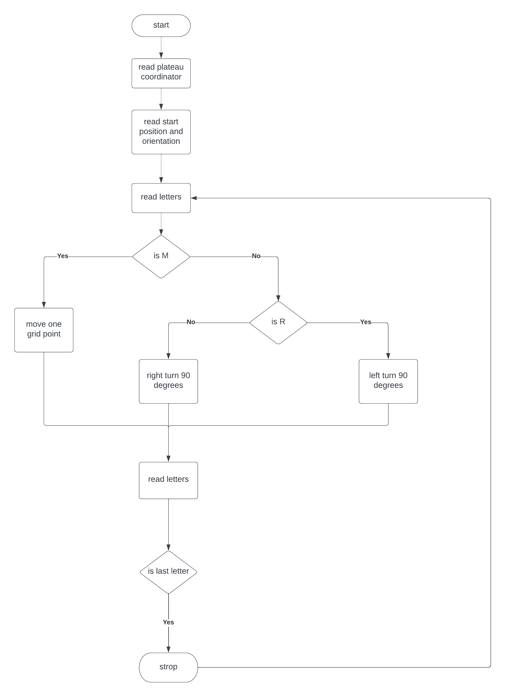
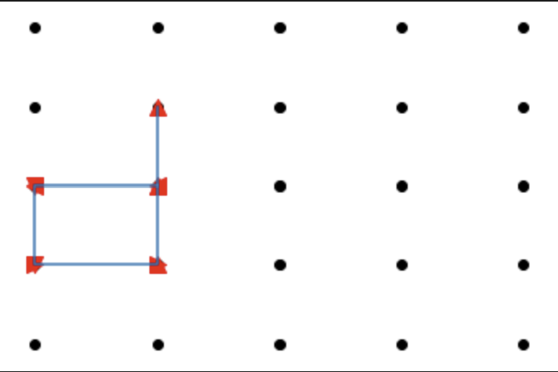

# MARS ROVERS

### Business Background

A squad of robotic rovers are to be landed by NASA on a plateau on Mars.
This plateau, which is curiously rectangular, must be navigated by the rovers so that their
onboard cameras can get a complete view of the surrounding terrain to send back to
Earth.
A rover's position is represented by a combination of an x and y co-ordinates and a letter
representing one of the four cardinal compass points. The plateau is divided up into a
grid to simplify navigation. An example position might be 0, 0, N, which means the rover
is in the bottom left corner and facing North.
In order to control a rover, NASA sends a simple string of letters. The possible letters are
'L', 'R' and 'M'. 'L' and 'R' makes the rover spin 90 degrees left or right respectively,
without moving from its current spot.
'M' means move forward one grid point, and maintain the same heading.
Assume that the square directly North from (x, y) is (x, y+1).

### Functional Specs

1. The first line of input is the upper-right coordinates of the plateau, the lower-left coordinates are assumed to be 0,0.
2. 'L' and 'R' makes the rover spin 90 degrees left or right respectively,
without moving from its current spot.
3. 'M' means move forward one grid point, and maintain the same heading.
4. Start point includes  x and y co-ordinates and a letter representing one of the four cardinal compass points.

### Program Workflow

### Output Demo

### Source Code (Python)
[Source Code](./Programming-Rovers.py)

### Continues Improvement
1. Change Arrow Symbol to Arrow line
2. Condition: movement beyond boarder
