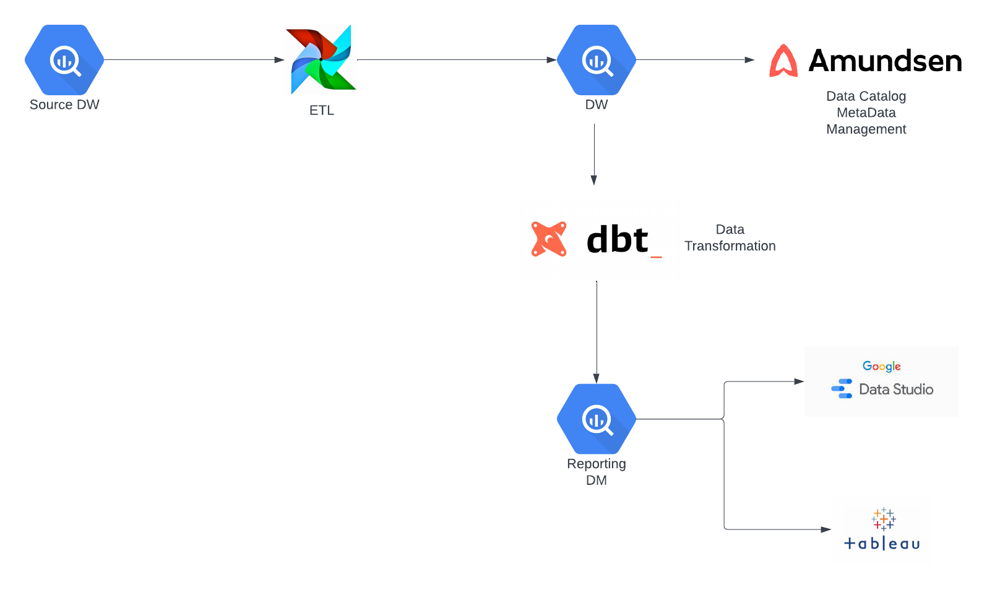
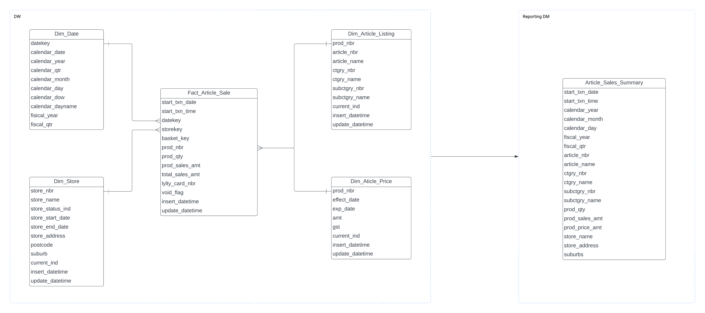
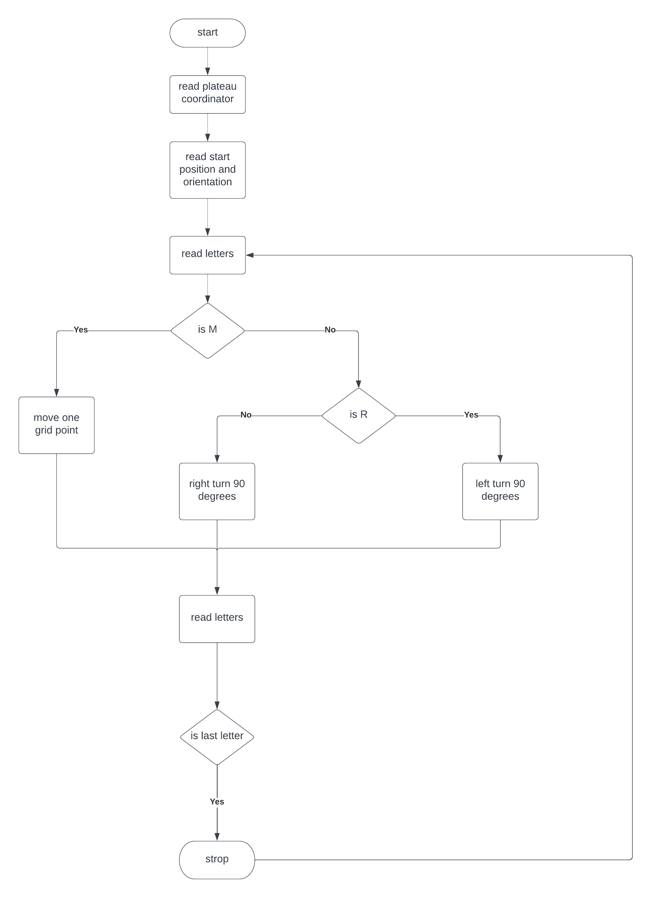

# Cartology Analytics Engineer - technical test #

This README would normally document whatever steps are necessary to get your application up and running.

## Data Modelling 

### Business Background

Company ABC has 1,000 stores across Australia selling approximately 100,000 different
items (SKUs). Not all 100,000 items are available in all the stores. Each store maintains the
list of items available in its store and has its own layout (aisle, bay) where the item is located.
Each store can also override the price and discount independently of other stores which is
called actual price. Each item also has some common attributes e.g. category, subcategory,
brand etc. The team at ABC wants to track the item attributes (e.g. category, subcategory,
location, price) at a particular point in time.

The number of sales transaction records totals to 30 million to 40 million per day. The
Analytics team at ABC are tasked to create the following reports refreshing daily.

### Business Requirements

* Get the item attributes per store at a particular point in time.
* The total sales for time period: Month/Week/Day
* The total sales by category/subcategory/item. Overlay the average actual price over the
period for the same selection filters.
* Drill into a particular Subcategory to get summary by stores and items (SKU)
level

### Functional Specs

1. Extract sales record and convert into fact table
2. Extract item attributes and convert into SCD-II dimension
3. Extract store record and convert into fact table
4. Add Date dimension for time period aggregate
5. Generate fact sheet for reporting

### Workflow Design

### ERD Design

## Programming 

### Business Background

A squad of robotic rovers are to be landed by NASA on a plateau on Mars.
This plateau, which is curiously rectangular, must be navigated by the rovers so that their
onboard cameras can get a complete view of the surrounding terrain to send back to
Earth.
A rover's position is represented by a combination of an x and y co-ordinates and a letter
representing one of the four cardinal compass points. The plateau is divided up into a
grid to simplify navigation. An example position might be 0, 0, N, which means the rover
is in the bottom left corner and facing North.
In order to control a rover, NASA sends a simple string of letters. The possible letters are
'L', 'R' and 'M'. 'L' and 'R' makes the rover spin 90 degrees left or right respectively,
without moving from its current spot.
'M' means move forward one grid point, and maintain the same heading.
Assume that the square directly North from (x, y) is (x, y+1).

### Functional Specs

1. The first line of input is the upper-right coordinates of the plateau, the lower-left coordinates are assumed to be 0,0.
2. 'L' and 'R' makes the rover spin 90 degrees left or right respectively,
without moving from its current spot.
3. 'M' means move forward one grid point, and maintain the same heading.
4. Start point includes  x and y co-ordinates and a letter representing one of the four cardinal compass points.

### Program Workflow

### Source Code (Python)
[Cartology-Programming-Rovers](./Cartology-Programming-Rovers.py)

### Continues Improvement
1. Change Arrow Symbol to Arrow line
2. Condition: movement beyond boarder